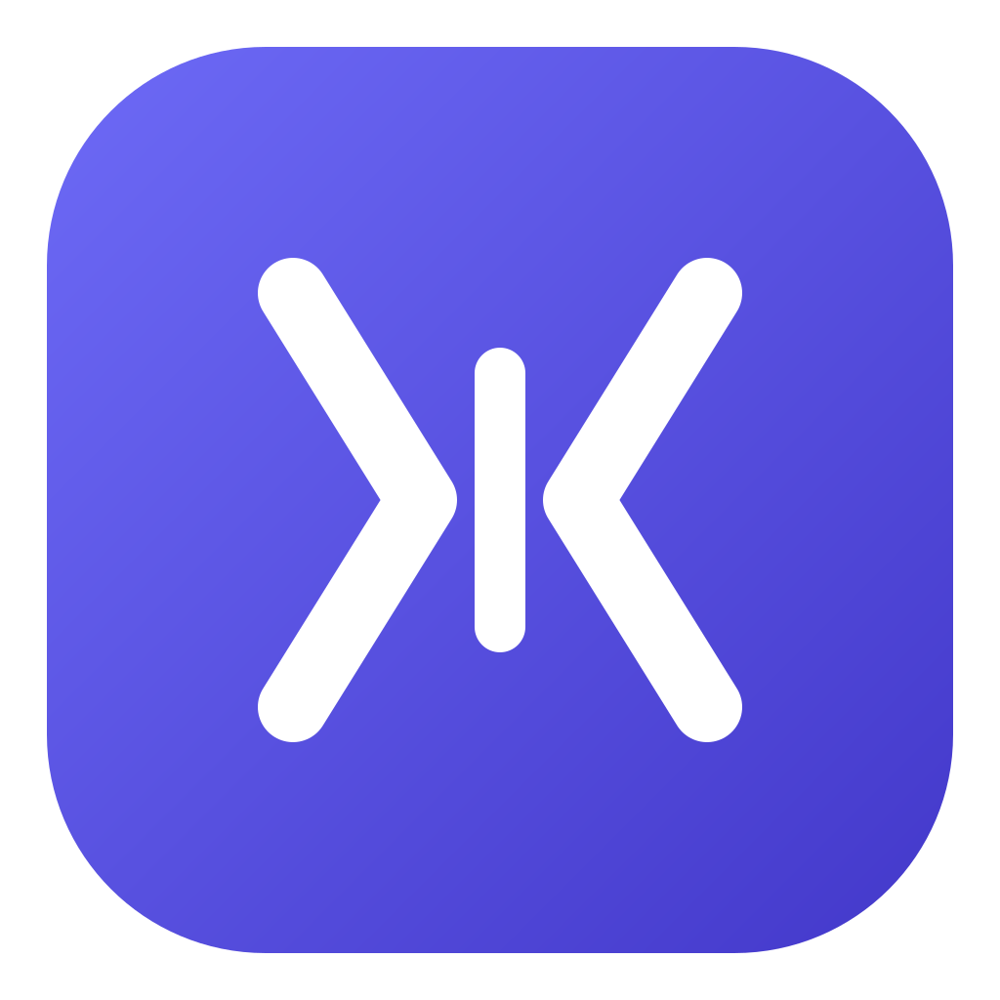

<p align="center">
  
</p>

<h1 align="center">Squeeze</h1>

<p align="center">
  A minimal, clean desktop app for compressing <b>videos</b> and <b>images</b> —
  ffmpeg and cwebp are bundled in, so it just works.
</p>

<p align="center">
  
  
  
</p>

---

## What is Squeeze?

Squeeze is a cross-platform (Windows + macOS) desktop app that shrinks media files
without making you touch a command line. It wraps two battle-tested encoders behind a
simple two-tab UI:

- **Video** → H.264 (`libx264`) **two-pass ABR**: give it a target size in MB per second
  and it hits that size precisely while keeping the best possible quality at that bitrate.
- **Image** → **cwebp** (WebP): visually-lossless, target-size, or quality modes.

Everything is self-contained — **ffmpeg, ffprobe, and cwebp ship inside the app**, so end
users don't install anything extra.

## Features

### 🎬 Video tab
- Target bitrate in **MB/s** with a live `≈ N kbps` readout
- **Two-pass ABR** encoding — accurate output size + best quality at that bitrate
- Keep audio (default) or remove it
- Quality/speed presets: **Fast / Balanced / Best** (`medium` / `slow` / `veryslow`)
- Always `High` profile, `yuv420p`, and `+faststart` (web-friendly progressive playback)

### 🖼️ Image tab
- **Visually lossless** (`-q 90`) — often 80–95% smaller than PNG with no visible loss
- **Target size** — type a KB number, cwebp multi-pass hits it
- **Quality** — pick 1–100
- Outputs `.webp`

### Both
- **Parallel batch** processing (concurrency 1–4)
- Drag & drop or file picker
- Per-item and overall live progress
- Finished items move to a **Completed** list showing the new size and **saved %**
- **Open output folder** button + per-item reveal-in-folder
- Smart output paths: default `<source-folder>/compressed/`, **never overwrites the input**,
  auto-suffixes name collisions

## Download

Grab a prebuilt binary from the [**Releases**](https://github.com/star-melon/squeeze/releases) page:

| Platform | File |
|----------|------|
| Windows | `Squeeze Setup x.y.z.exe` (installer) — or `Squeeze-x.y.z-win.zip` (portable, unzip & run) |
| macOS · Apple Silicon | `Squeeze-x.y.z-arm64.dmg` |
| macOS · Intel | `Squeeze-x.y.z.dmg` |

> The apps are **not code-signed**. On first launch:
> - **macOS** — Gatekeeper may block it: right-click the app → **Open** → **Open**, or run
>   `xattr -cr /Applications/Squeeze.app`.
> - **Windows** — on the SmartScreen prompt click **More info → Run anyway**.

## Run from source

```bash
npm install
npm start
```

Requires [Node.js](https://nodejs.org/) (LTS). **ffmpeg/cwebp are pulled in by `npm install`** —
no separate setup or PATH config.

> **Slow/blocked downloads (e.g. in mainland China)?** Electron and the media binaries are
> fetched from GitHub and may time out. Use a mirror:
> ```bash
> export ELECTRON_MIRROR=https://npmmirror.com/mirrors/electron/
> export ELECTRON_BUILDER_BINARIES_MIRROR=https://npmmirror.com/mirrors/electron-builder-binaries/
> npm install --registry=https://registry.npmmirror.com
> ```
> On Windows PowerShell use `$env:ELECTRON_MIRROR="..."` instead of `export`.

## Build installers

Output goes to `dist/`. **Build each platform on its own OS** — the bundled native binaries
can't be cross-compiled.

```bash
npm run build:win    # Windows → NSIS installer + portable zip
npm run build:mac    # macOS  → DMG (run on a Mac)
```

macOS builds for the host architecture, so build on Apple Silicon for an arm64 DMG and on
Intel for an x64 DMG. The included GitHub Actions workflow
([`.github/workflows/release-mac.yml`](.github/workflows/release-mac.yml)) builds **both**
arches and publishes a GitHub Release whenever you push a `v*` tag:

```bash
git tag v0.1.0 && git push origin v0.1.0
```

## How it works

- **Video** — per file: pass 1 analyzes to a null sink, pass 2 encodes to the target bitrate
  (`libx264 -b:v <kbps> -pass 1|2 -preset <preset> -profile:v high -pix_fmt yuv420p … -movflags +faststart`).
  The renderer derives `kbps` from your MB/s (`MB/s × 8192`, minus 128 kbps for audio when kept).
- **Image** — `cwebp -mt -m 6` plus `-q 90` (visually lossless), `-pass 10 -size <bytes>`
  (target size), or `-q <n>` (quality).
- **Packaging** — ffmpeg/ffprobe/cwebp are unpacked from the asar archive (`asarUnpack`) and
  resolved at runtime via the `app.asar → app.asar.unpacked` path fix.

## Project structure

```
squeeze/
├─ src/
│  ├─ main.js              # Electron main: window, IPC, encode engines, queue
│  ├─ preload.js           # contextBridge — the window.squeeze API
│  └─ renderer/
│     ├─ index.html        # tabbed UI
│     ├─ styles.css
│     └─ renderer.js       # UI logic (one panel factory reused for both tabs)
├─ build/                  # app icons + macOS entitlements (used when packaging)
├─ .github/workflows/      # CI: build & publish the macOS release
├─ gen-icon.js             # regenerate icon.png/.ico from icon.svg
└─ package.json
```

## Tech stack

[Electron](https://www.electronjs.org/) · [electron-builder](https://www.electron.build/) ·
`ffmpeg-static` · `ffprobe-static` · `cwebp-bin`. No UI framework — plain HTML/CSS/JS for a
small, fast bundle.

## Contributing

Issues and pull requests are welcome. To hack on it: `npm install`, then `npm start`. The
renderer is plain JavaScript, so changes show on reload.

## License

[MIT](LICENSE) © starmelon
